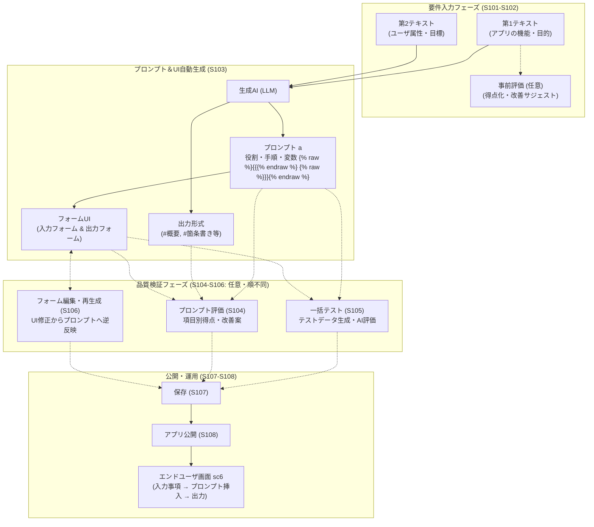
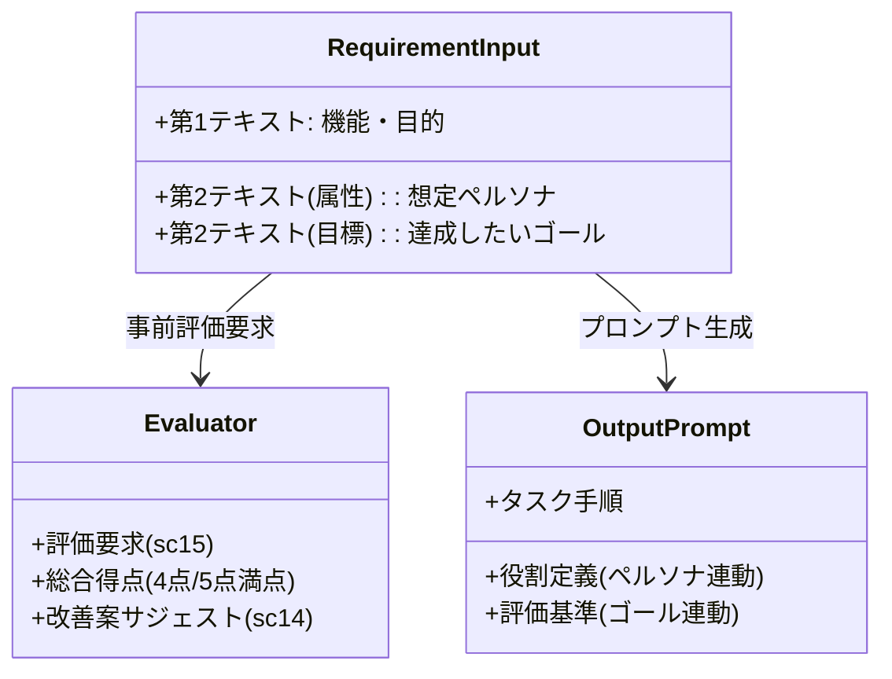
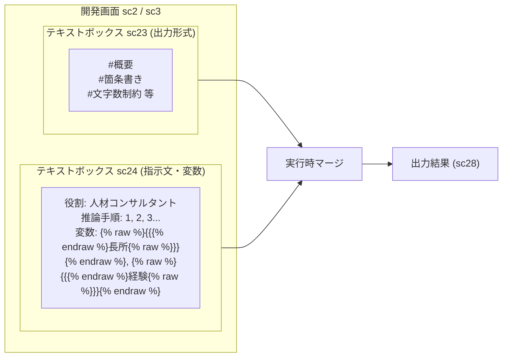
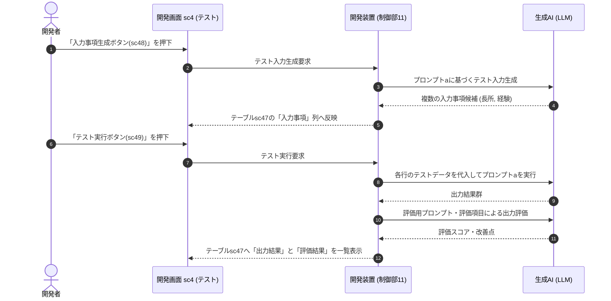
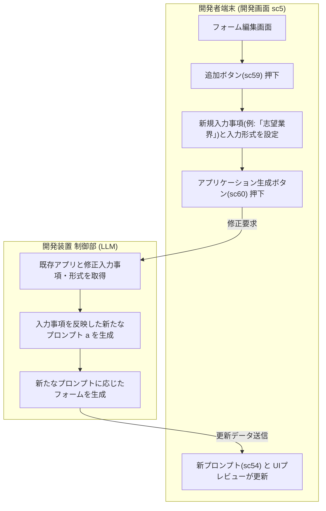
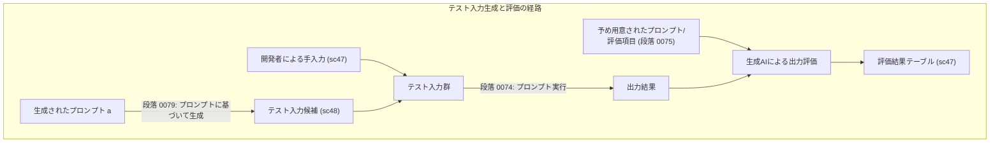

生成AIの進化に伴い、社内業務の効率化や特定タスクの自動化を目的とした「LLMアプリケーション」の構築ニーズが急増しています。しかし、従来のノーコード／ローコードツールを現場に導入しようとすると、ツール独自のブロック配置や複雑なワークフロー定義の習得が必要となり、「誰でも使える」という理想には依然として高い壁が存在していました。一方、チャットボットに自由入力させるアプローチでは、プロンプトの書き方によって出力品質が大きく乱れ、業務成果物としての安定性に欠けるという課題があります。

こうした「ノーコードの操作学習摩擦」と「プロンプト記述の品質不安定性」を同時に解消するアプローチとして注目されるのが、株式会社ELYZAが出願・公開した特許公報（特開2026-108998 / 特許第7759639号「アプリケーション開発システム、方法及びプログラム」）に開示された開発システムです（本特許の技術的思想は、同社のプロダクト展開とも通底するものと見られますが、本稿では公報の開示内容に即して技術的特徴を検討します）。なお、特許の実施形態は権利範囲や具体的実装の例示であり、実際の商用サービス仕様や性能実証と直ちに同一視できるわけではない点には留意が必要です。

本稿では、特許公報の実施形態（段落【0031】〜【0099】）およびUI図面（図4〜図10）に開示されている処理フロー（S101〜S108）を紐解き、この設計がAIノーコード／プロンプト駆動型アプリ開発基盤としてどのように機能するのか、そのアーキテクチャの特徴を技術・プロダクト設計の視点から分析します。

---

## 1. 全体アーキテクチャの本質：なぜ従来のノーコードと一線を画すのか？

従来のノーコードツールは、「GUI上で部品（テキストボックスやボタン、データソースコネクタ）を人間が手作業で配置・結線し、ロジックを組む」というアプローチが主流でした。

これに対し、公報に開示されているシステムアーキテクチャは、**「自然言語によるアプリ概要（第1テキスト）から、実行時プロンプトとフォームUI（入力・出力）を導出する」**という変数バインディングの思想に基づいています。

*(注: 公報段落【0030】に記載の通り、S102およびS104〜S106は省略可能であり、S104〜S106は順不同で実行できます)*

開発者はプログラミングコードを書かないばかりか、**「入力フォームを何個並べ、どういう名前にするか」「それらをどうプロンプトのプレースホルダーへマッピングするか」という画面定義の初期作業を大きく省力化**できます。自然言語要件からプロンプトを生成し、そのプロンプトに基づいてフォームUIを組み立てる自動バインディングこそが、本特許設計の中核をなす特徴です。

---

## 2. 徹底解剖：公報から読み解く5つの機能的特徴

公報の図面（図4〜図10）と各ステップ（S101〜S108）を分析すると、実務でLLMアプリを構築・運用する際に直面する課題に対応しようとする5つの優れた設計が見えてきます。

### 特徴①：「第1テキスト＋第2テキスト」による文脈精度の担保と事前改善

一般的なプロンプトジェネレータは「何を作りたいか」という機能要件のみを入力させがちです。しかし、公報のステップS101（図5: 開発画面sc1）では、入力を明確に2系統に分離しています。

* **第1テキスト（テキストボックスsc11）**: アプリケーションの内容・機能・目的（例：「自分の長所を踏まえた自己ＰＲを作成する」）
* **第2テキスト（テキストボックスsc12, sc13）**: アプリケーションを利用するユーザーの属性および達成目標（例：属性「就職活動中の大学生」、目標「志望する企業からの内定」）

#### なぜこれが有効なのか？
LLMは「誰が、何のために使うのか」という文脈が欠落すると、平均的で無難な回答に逃げてしまいがちです。「就活生の内定獲得」というペルソナとゴールが事前に注入されることで、生成されるシステムプロンプトには自動的に「経験豊富な人材コンサルタント」「採用担当者の視点」といった役割定義（System Persona）やトーンが埋め込まれやすくなります。

さらに、入力段階で**「評価ボタン（sc15）」を押すことで、生成AIが第1テキストを事前に診断（ステップS102、任意）**できます。「4点／5点満点」といった定量スコアとともに、
> *改善案1：自分の長所を踏まえた自己ＰＲを４００字以内で作成する*  
> *改善案2：自分の長所を踏まえた履歴書に載せる自己ＰＲを作成する*

といった具体的な具体化・制約追加のアドバイス（テキストボックスsc14）が提示されます。「良いプロンプトを作るための要件定義そのものをAIが支援する」という二重の支援構造が成立しています。

---

### 特徴②：「変数（`{{ }}`）の自動抽出」と「UIフォームの自動バインディング」

要件が入力されて「アプリケーション生成ボタン（sc16）」が押されると、ステップS103が実行されます。ここで制御部（LLM）は、単に命令文を作るだけでなく、**「エンドユーザーが実行時に入力すべき可変パラメータ」を自律的に検出し、変数記法（`{{長所}}`、`{{経験}}`）としてプロンプト内へ埋め込みます**（図6: sc24）。

> **【自動生成されるプロンプトの例】**（公報図6・段落【0058】をもとにした模式的構成）
> 
> あなたは経験豊富な人材コンサルタントです。  
> 入力事項を元に、就職活動における説得力のある自己PRを作成してください。
> 
> **# 入力情報**  
> - 長所: `{{長所}}`  
> - 経験: `{{経験}}`  
> 
> **# 作成手順**  
> 1. `{{長所}}` が発揮されたエピソードとして `{{経験}}` を位置づける。  
> 2. 企業の採用担当者に響く強みとして言語化する。

そして、生成されたプロンプトに基づいて**対応する入力フォーム（テキストボックスsc27）および結果表示フォーム（sc28）が自動生成**されます（段落【0049】。なお公報ではウェブに限らずデスクトップやモバイル等のUIも含み得るとされています）。

| 構成要素 | 自動生成の挙動 | 開発者の手作業 |
|---|---|:---:|
| **プロンプト内変数** | 第1・第2テキストから可変要素（`{{長所}}`, `{{経験}}`）を自動決定 | **最小限** |
| **入力UIフォーム** | 各変数に応じた入力欄（テキストボックス、選択式等）を自動配置 | **最小限** |
| **出力UIフォーム** | 出力結果を表示する領域を自動配置 | **最小限** |
| **データバインディング** | 画面入力値を変数へ代入してLLMを実行する連携を自動構成 | **最小限** |

開発者は「変数名」や「UIコンポーネントの配置」を個別に入力することなく、ワンクリックで「動くアプリのプロトタイプ」を得ることができます。

---

### 特徴③：「プロンプトの可視化・直接編集性」と「出力形式の分離管理」

ノーコードツールでは、生成物がブラックボックス化すると「言い回しを変えたいときにどこを修正すればいいか分からない」という保守上の摩擦が生じやすくなります。

公報の設計画面（図6: 開発画面sc2）は、生成されたプロンプトを隠蔽せず、開発者が直接手を入れられる構成をとっています。特に特徴的なのは、**プロンプト本体（sc24）と「出力形式（sc23）」の表示・管理を分けている点**です。

#### 出力形式を分離する実務的メリット
LLMの出力トラブルで頻見されるのが、「出力フォーマットの崩れ（指定したマークダウンにならない、箇条書きが欠落するなど）」です。公報段落【0057】にあるように、出力形式を指示文と分けて独立して表示・修正可能とすることで、指示ロジックを直接書き換えることなく、フォーマットの指定や調整を行いやすくしています。

---

### 特徴④：開発ループを支える「組み込みテスト＆自動評価機構」

プロンプト開発では、1つの入力例で意図通りに動いても、異なる入力値が渡された際に出力が乱れることがあります。

公報のステップS104・S105（図7: 開発画面sc3、図8: 開発画面sc4）は、開発画面内にテストおよび評価の支援機構を設けています。

1. **テストデータ（入力事項）の生成支援（sc48）**:
   開発者が入力欄を手入力できるほか、「入力事項生成ボタン」を押すことで、制御部がプロンプトaに基づいて複数の入力事項（長所×経験のテストデータ）を生成し、テーブルsc47に提示します（段落【0078】〜【0079】）。
2. **一括テスト実行とAI評価（sc49）**:
   「テスト実行ボタン」を押すと、複数の入力事項に対してプロンプトaがまとめて実行され、その出力結果および予め用意されたプロンプトや評価項目に基づく評価結果（得点や問題箇所、改善案）がテーブルに一覧表示されます（段落【0075】〜【0080】）。
3. **プロンプト自体の評価支援（sc37, sc38）**:
   ステップS104では、プロンプト本体の構成や適切さを評価項目別得点（評価項目1：4/5点、評価項目2：3/5点など）や問題点・改善案として取得できます。

これにより、外部の評価スクリプトを用意せずとも、GUI上でプロンプトの一括試行・評価ループを回すことが可能になります。

---

### 特徴⑤：「フォーム編集とプロンプトの双方向同期（リバースシンク）」

アプリの試作が進むと、「入力項目に『志望業界』を追加したい」「入力形式を選択式に変えたい」といったUI側の変更要望が生じます。

従来の開発形態では、UIに入力欄を追加したあと、プロンプト側でも該当する変数を探し、`{{志望業界}}` の挿入や指示文の加筆を手作業で行う必要があり、設定の不整合が生じやすい作業でした。

公報のステップS106（図9: 開発画面sc5）では、この同期を**「UIフォーム側からプロンプトへ逆反映する（リバースシンク）」**アプローチで対応しています。

開発画面sc5で入力項目（sc57）を追加・修正して「アプリケーション生成ボタン（sc60）」を押すと、制御部11がLLMを利用して**修正された入力事項や入力形式を反映した新たなプロンプトaおよびフォームを再生成**します（段落【0088】〜【0090】）。

プロンプト本文を直接書き換えるのが難しいユーザーであっても、フォーム項目の編集を通じてプロンプトの更新を試みることができる親切な設計です。

---

## 3. 公開・運用フェーズ（S107〜S108）とエンドユーザー体験

テストや調整を経たアプリケーションは、「保存（S107）」を経て「公開ボタン（sc20 / sc30 / sc40 / sc50）」を選択することで、任意の審査を経て公開されます（ステップS108）。

図10に開示されているエンドユーザー向け画面（sc6）は、開発画面の編集機能を排したシンプルなフォームUIです。

> **【自己PR作成アプリ（エンドユーザー画面 sc6）】**
> 
> * **【長所】 (sc61)**  
>   `粘り強く最後までやり遂げること`
> * **【経験】 (sc61)**  
>   `アルバイト先での新人教育マニュアルの刷新`
> 
> [ 実行する (sc63) ]
> 
> ---
> 
> * **【生成結果】 (sc62)**  
>   **# 概要**  
>   私の強みは、課題に対して粘り強く向き合い...  
>   **# 具体的なエピソード**  
>   アルバイト先において...

エンドユーザーは、背景にあるプロンプト構造を意識することなく、必要な入力欄（sc61）を入力して実行ボタン（sc63）を押すことで、定型化された出力結果（sc62）を取得できます。

---

## 4. 何でも作れるわけではない：ELYZA Worksだけでは完結しないシステム

2026年9月3日、ELYZAは、本特許が法人向け生成AI活用ツール「ELYZA Works」の中核機能を対象とすることを[公式に発表](https://elyza.ai/news/2026/09/03/works_patented_created_viaai)しました。ただし、現在のELYZA Worksを、ここまで見てきた単発のフォーム型アプリだけで理解するのも正確ではありません。2026年9月5日時点の公式発表では、外部サービスの情報を参照する[連携機能](https://elyza.ai/news/2026/01/26/elyza-works%E3%81%AB%E3%81%8A%E3%81%84%E3%81%A6%E5%A4%96%E9%83%A8%E3%82%B5%E3%83%BC%E3%83%93%E3%82%B9%E9%80%A3%E6%90%BA%E6%A9%9F%E8%83%BD%E3%81%AE%E6%8F%90%E4%BE%9B%E3%82%92%E9%96%8B)、人の確認を挟みながら複数アプリを接続する[後続アプリ設定機能](https://elyza.ai/news/2026/07/01/works_feature_connectapps)、ファイル分析・Webでの情報収集・複数ステップの自律実行を再利用可能なアプリにする[AIエージェントからのアプリ作成機能](https://elyza.ai/news/2026/08/31/works_feature_appcreation_viaaiagents)まで提供されています。

それでも、生成AIを使って「成果物を作れる」ことと、あらゆる業務システムの中核を担えることは同じではありません。ここでいう「作れない」とは、画面や処理を一切構成できないという意味ではなく、**公開資料で確認できるELYZA Worksの機能だけでは、安全性や整合性を含めて完結させにくく、別のシステムに責任を持たせるべき領域がある**という意味です。

| ELYZA Worksだけでは完結させにくいシステム | 不足する設計上の責任 | 現実的な役割分担 |
|---|---|---|
| **取引の正本となるシステム**（決済、会計台帳、在庫引当、受発注） | 同時更新の整合性、二重実行の防止、ロールバック、確定履歴の保持 | ELYZA Worksは入力整理、照会、説明、下書きを担い、確定更新はトランザクションを備えたドメインサービスとデータベースが担う |
| **規制・権利に関わる最終判断システム**（融資可否、採用・人事処分、医療判断、アカウント停止） | 再現可能な判定規則、根拠の追跡、異議申立て、権限分離、人による承認 | ELYZA Worksは資料収集や判断支援に使い、最終ゲートは明示的なルールと承認ワークフローの外部に置く |
| **ハードリアルタイム／安全制御システム**（設備制御、車両制御、緊急停止） | 応答時間の上限、フェイルセーフ、決定論的動作、安全認証 | 制御ループは専用の制御系に置き、ELYZA Worksは報告書作成や保守情報の検索など非同期の支援に限定する |
| **任意の画面・状態遷移を持つ汎用業務システム**（複雑なCRUD、独自UI、細かな権限モデル） | 画面遷移、永続状態、認可、監査、例外処理をコードと設定で厳密に管理する仕組み | 専用のアプリケーション基盤を本体とし、ELYZA Worksは外部サービス連携などを通じて生成AI部分を受け持つ |

### 制約は欠点ではない——ステークホルダーに「忖度」した設計

上表のような適用範囲の狭さは、単なる機能不足とは限りません。ELYZA自身も、入出力を標準化した従来型のエンタープライズシステムは高コストと専門性を要し、現場の細かな非定型業務には導入しにくいと説明したうえで、ELYZA Worksをそうした日常業務へ投入できるツールとして位置づけています（[2026年5月11日の公式発表](https://elyza.ai/news/2026/05/11/works_promotion_start)）。これは「被害を小さくするため」という開発意図を直接示すものではありませんが、結果として、生成AIの不確実性が及ぶ範囲を限定する製品配置になっていると解釈できます。

ELYZA Worksが主に扱う報告書、企画書、分析結果、判断材料は、人が確認してから利用できる成果物です。AIが誤っても、出力を修正する、処理をやり直す、採用しないという選択を残しやすい。さらに、後続アプリ設定機能は、一つの業務フローをマイクロタスクへ分割し、各段階で人間が確認・修正する構造を採っています。失敗を工程内に閉じ込め、後続処理への連鎖を止められることは、フォームの使いやすさとは別種の安全性です。

この境界は利用者だけでなく、システム開発・運用を担うベンダーも守ります。生成AIが作った確率的で説明しにくい判断を基幹システムへ直接埋め込めば、障害時の原因究明、品質保証、SLA、契約上の責任まで、既存システムの担当者へ曖昧なまま移されかねません。ELYZA Worksを正本の外側に置く限り、既存システムは整合性と確定処理を、ELYZA Worksは曖昧な要望の構造化と成果物生成を、それぞれ引き受けられます。

本稿では、このように能力の範囲を絞ることで、利用者、運用者、開発ベンダーの被害半径と責任範囲を限定する性質を、あえて**「ステークホルダーに忖度した設計」**と呼びます。ここでの「忖度」は、特定の関係者へ迎合するという意味ではなく、失敗時に誰が影響を受け、誰が修正と説明を引き受けるのかを先回りして考慮する、**意図的な非万能性**を指します。

とりわけ、外部サービス連携やAIエージェントによって外部へ作用できる範囲が広がるほど、「呼び出せること」と「確定処理を安全に任せられること」の区別が重要になります。出力が人間への**提案**である間は、誤りを確認して差し戻せます。しかし、出力が送金、在庫確保、権限剥奪といった**取り消しにくい状態変更**へ直結するなら、入力検証、冪等性、権限確認、承認、監査ログを生成AIの外側で強制しなければなりません。

ELYZA Worksが得意とするのは、曖昧な自然言語の要望を、再利用可能な業務AIアプリや業務プロセスへ変換することです。その価値を損なわずに適用境界を引く問いは単純です。**「この出力は人が検討する案なのか、それとも組織の正本を変更する命令なのか」**。後者であるほど、次節で扱うドメインモデルと独立した検証・制御の層が必要になります。

なお、これはELYZAが公表した非対応機能の一覧ではなく、2026年9月5日時点の公開資料と本特許の開示範囲から導いた設計上の適用境界です。契約プラン、個別開発、今後の機能追加によって実際の対応範囲は変わり得ます。

---

## 5. 批判的考察：ドメインモデルの不在とテスト設計の課題

特開2026-108998が提示する仕組みは、非エンジニアが自然言語からLLMアプリを素早く立ち上げるプロトタイピング環境として、極めて洗練されています。

しかし、本ブログでこれまで探究してきた**「形式知としてのソフトウェア設計」**（[コードは思考の圧縮結果である](https://hideshi.github.io/blog/2026/09/04/code-as-compressed-cognition/)）や、**「検証ハーネスの独立性」**（[一次情報を渡しても、LLMは事実を見失う](https://hideshi.github.io/blog/2026/09/04/why-primary-sources-are-not-enough-for-llms/)）という観点からこの公報を精査すると、業務システムとして長期運用・スケールさせる際に直面する構造上の限界や設計課題が浮かび上がってきます。

プロダクトの真価と限界を客観的に捉えるために、以下の2点から批判的な考察を試みます。

### (1) ドメインモデルの不在と「合成暗黙知」のリスク

前稿「[コードは思考の圧縮結果である](https://hideshi.github.io/blog/2026/09/04/code-as-compressed-cognition/)」では、コードという形式知が他者にとってブラックボックス化する理由を解き明かしました。そこでは、設計意図を他者が安全に展開できるようにするための「3層の足場」として、以下を整理しました。

1. **ドメインモデル**（ユビキタス言語、値オブジェクト、集約、不変条件）
2. **実行可能な仕様**（受入条件を反映したテストコード）
3. **コード外の足場**（設計判断の理由と捨てた選択肢を残すADR）

特開2026-108998の開示内容をこの枠組みに当てはめると、**何が形式知化され、何が公報の開示範囲外に残されているのか**が整理できます。

| 区分 | 公報の開示範囲・システムの特徴 |
| :--- | :--- |
| **形式化・保存されているもの** | ・入力スキーマ（変数 `{{...}}`）と出力形式（sc23） ・UIフォーム定義（sc57, sc58） ・テスト入力・出力結果・評価結果のテーブル（sc47） ・第1・第2テキスト、プロンプト、各評価・テスト履歴（段落【0092】） |
| **依然として暗黙的、または公報に明示的仕組みがないもの** | ・機械的に強制される不変条件（絶対に違反させない制約境界） ・自然言語プロンプト（sc24）内部の曖昧な依存関係 ・変更前後の差分理由や棄却した選択肢の記録（ADR） ・人が理解・説明できる水準の「答え責任（Answerability）」 |

#### 自然言語プロンプトは単独では「強制力ある整合性境界」にならない
自然言語プロンプトであっても、業務のドメイン知識やルールを文章として表現することは十分に可能です。
しかし、ドメイン駆動設計（DDD）における「集約（Aggregate）」や「不変条件（Invariants）」の本質は、型検査やバリデーション、トランザクション境界といった実装によって「どのような入力であっても、この業務規則だけは絶対に違反させない」という整合性を機械的に強制できる点にあります。

プロンプトに「出力文字数は400字以内とする」「個人情報を出力に含めてはならない」「承認ステータスが完了でない場合は処理を拒否する」と自然言語で記述したとしても、それは確率的なLLM挙動に対する指示にとどまります。機械的に保証される制約境界（Guardrail）を持たなければ、業務システムとしての堅牢なドメインモデルの代替とは言えません。

#### 変更理由（Why）の外化と「合成暗黙知」のリスク
公報の段落【0092】では、保存時に第1・第2テキスト、プロンプト、各評価結果やテストデータが保存されると記載されています。成果物や各時点のデータ自体は記録されます。
一方、ステップS102/S104でのAI改善案の採択や、ステップS106でのフォーム編集に伴うプロンプト再生成（リバースシンク）において、**「変更前後の差分」「なぜその文言に変更されたのか」「何をトレードオフとして棄却したのか」という決定理由を履歴として管理する仕組みは、公報上明示されていません**。

前稿「コードは思考の圧縮結果である」で指摘した通り、AIによる生成それ自体が問題なのではなく、**「自動再生成された変更を、人間が十分に理解・検証せず、理由も記録しないまま採用すること」**が最大のリスクです。これによって、アプリ作成者本人すらプロンプト内の各フレーズの必要性や意図を説明できない「合成暗黙知（Synthetic Tacit Knowledge）」が蓄積し、障害発生時や業務改定時に修正を引き受けられない「答え責任（Answerability）」の空洞化につながる懸念があります。

---

### (2) テスト入力の結合と評価ハーネスの課題

ステップS105（図8）のテスト機能（入力事項自動生成・テスト実行・AI自動採点）は、GUI上でプロンプトの挙動確認を支援する優れた機能です。

しかし、前稿「[一次情報を渡しても、LLMは事実を見失う](https://hideshi.github.io/blog/2026/09/04/why-primary-sources-are-not-enough-for-llms/)」で論じた**「検証ハーネスの独立性」**という観点から見ると、設計上の注意すべき論点が存在します。

#### テスト設計元の結合による「共通原因故障」のリスク
公報段落【0079】には、次のように記載されています。

> *「入力事項生成ボタンｓｃ４８が選択されると、制御部２１は、プロンプトａを開発装置１に送信し、開発装置１に入力事項の生成を要求する。開発装置１の制御部１１は、…取得したプロンプトａに基づいて入力事項を生成し、…テーブルｓｃ４７の入力事項のカラムに表示する」*

この機能は、開発者がテストデータをゼロから作成する手間を大幅に軽減します。
一方で、独立した要求仕様や受入条件からテスト入力を導出する仕組みは公報上明示されておらず、**テスト入力の生成元が「すでに生成されたプロンプトa自身」に結合**しています。

もし初期のプロンプト生成（S103）の段階で業務要件の重要なエッジケースや前提が脱落していた場合、そのプロンプトに基づいて生成されるテスト入力候補もまた同じ盲点を引き継ぎやすくなります。この「共通原因故障（Common Cause Failure）」のリスクには留意が必要です（ただし公報段落【0078】にある通り、開発者が手動でテスト入力を追加・修正できる経路も開示されているため、検証経路が全面的に閉塞しているわけではありません）。

#### ヒューリスティックなOracleと評価の再現性
本システムのテストテーブル（sc47）に並ぶのは、「入力事項」「出力結果」「評価結果（得点・理由）」です。
公報には、明示的な期待出力や決定論的アサーション（終了コードや完全一致など）は示されていません。

公報段落【0075】〜【0076】によれば、出力結果の評価には「予め用意されたプロンプト」や「予め設定された評価項目」が利用されます。これはLLMを活用した「ヒューリスティックなTest Oracle（判定器）」として機能し得ます。
しかし、LLMによる評価は確率的推論であるため、モデルの更新や温度設定によって評価スコアがぶれる可能性があり、微細なリグレッション（意図しない挙動変化）を検出する手段としては別途の校正（確証バイアスの抑制や決定論的チェックの併用）が求められます。

---

## 6. まとめ：プロンプトUIの特徴と、その先にある設計課題

特開2026-108998（特許第7759639号）に開示されたアーキテクチャは、LLMをノーコードで業務ツール化する際に立ちはだかる課題に対し、洗練されたユーザーインターフェース設計を提示しています。

本公報が示すエッセンスは、以下の5点に整理されます。

1. **要件定義の二重化と事前改善**: 単一入力に依存せず、機能とペルソナ・ゴールを分離し、要件の入力段階でAIによる評価・改善案を得る。
2. **変数抽出とUIの自動バインディング**: プロンプト内の変数を検出し、対応する入力・出力フォームを自動構築する。
3. **出力形式の分離管理**: 指示文と出力フォーマット指定を物理的に分離し、書式の崩れを防止しやすくする。
4. **組み込みテスト・評価ループ**: プロンプトからのテスト入力生成と一括実行、AI評価を同一画面内で支援する。
5. **フォームとプロンプトの双方向同期（リバースシンク）**: UIフォーム側の項目修正からプロンプトを再生成し、メンテナンス摩擦を軽減する。

同時に、本稿で検討した批判的考察が示すように、こうしたプロトタイピング基盤を堅牢な業務基盤へと昇華させるためには、さらなる設計の発展が期待されます。

* **決定論的制約とドメインモデルの統合**: 自然言語プロンプトの柔軟性を活かしつつ、文字数、禁止事項、データスキーマ、業務権限などを機械的に強制する「ガードレール層」との結合。
* **変更理由（Why）の外化**: プロンプトの自動再生成において、どのような改善が加えられ、何を捨てたのかを記録する「プロンプト版ADR（構成管理と変更理由の可視化）」。
* **多層的な検証ハーネス**:
  1. *第1層（決定論的検証）*: スキーマ、禁止事項、出力長などを確定的チェッカーで検査する。
  2. *第2層（校正済みルーブリック評価）*: 業務側が定義した明確な評価基準・アンカー事例を用いたモデル評価。
  3. *第3層（独立した要件・障害履歴からのテスト生成）*: プロンプトとは独立した受入条件や過去の不具合事例に基づくエッジケース検証。

特許公報に示された優れたUI/UXの設計思想を基礎としつつ、ソフトウェア工学が培ってきた形式知と検証ハーネスの原則をいかに融合させていくか。それこそが、実用的なAI駆動開発基盤の次なる到達点となるはずです。
